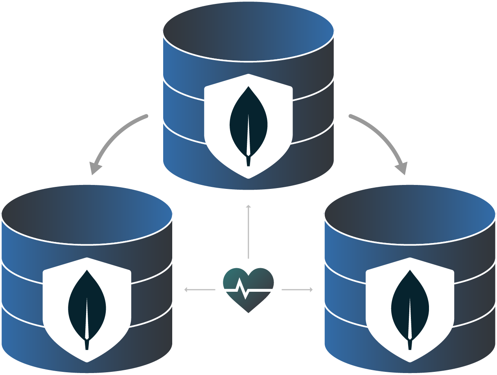

# Marketplace MongoDB Cluster

Deploy a High Availability MongoDB replica set cluster consisting of 3 members.

**Distributions:**

- Debian 11 

**Mongo:**

 - 5.0

## Documentation
Deployment guide:
- [Deploying a MongoDB replica throught the Linode Marketplace]()

Additonal resources:
- [MongoDB replica set](https://www.mongodb.com/docs/manual/replication/)

## Contributing
Contributions are welcome! Please generally adhere to the [sample directory layout](https://docs.ansible.com/ansible/latest/user_guide/sample_setup.html#sample-ansible-setup) and best practices/recommondations from the latest Ansible [User Guide](https://docs.ansible.com/ansible/latest/user_guide/index.html).

Please read the [developement guidelines](docs/DEVELOPMENT.md) for help with setting up a development environment and the [contributing guidelines](docs/CONTRIBUTING.md) for help creating your first Pull Request.

## Reaching Out
To report a bug or request a feature, please open a GitHub Issue. For general feedback, use feedback@linode.com.

## Author
- Elvis Segura (@n0vabyte)